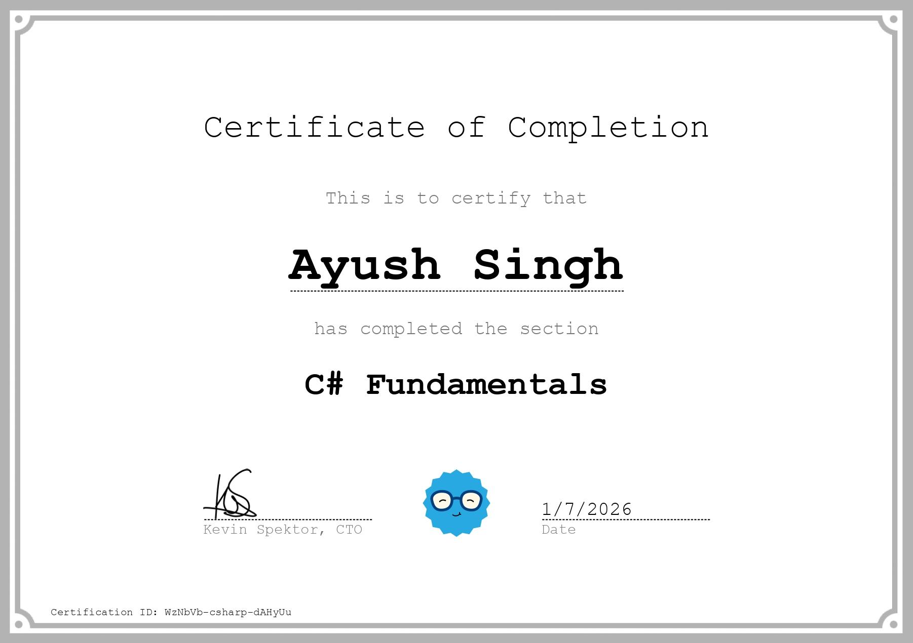

> Day 2 06/23/2026 to Day 06/30/2026

During these two weeks I learned basics of C# programming from [Coddy.tech](https://coddy.tech/journeys/csharp) which I recommend or any similar platform to learn the basics so to have hands on experience on writing code in place of learning from theory.
And don't worry about the speed you can be faster in learning or slower but I suggest learning with actually writing some code.

List of topics Covered in *Section 1*
###### **Fundamentals**
- [+] Introduction
- [+] Variables Part 1
- [+] Variables Part 2
- [+] Operators Part 1
- [+] Operators Part 2
- [+] Decision Making
- [+] Basic IO
- [+] Calculator App
- [+] Loops
- [+] Methods (Functions)
- [+] Arrays Basics
- [+] String Operations
- [+] Iterating Over Collections
- [+] Final Challenges

> Completed by 07-01-2026

---

List of topics Covered in *Section 2*

###### **Logic & Flow**
- [ ] Multi-dimensional Arrays
- [ ] Advanced Decision Making
- [ ] Loop Enhancements
- [ ] Flow Control Techniques
- [ ] Exception Handling
- [ ] Null Handling
- [ ] Logical Operators Advanced
- [ ] Data Analysis System
- [ ] HashMap Part 1
- [ ] HashMap Part 2
- [ ] HashSet Part 1
- [ ] HashSet Part 2

---
List of topics Covered in *Section 3*
##### **Object Oriented Programming**
- [ ] Fundamentals of OOP
- [ ] Properties & Static Members
- [ ] Class Architecture
- [ ] Inheritance
- [ ] Polymorphism & Interfaces
- [ ] Encapsulation
- [ ] Advanced Features
- [ ] Advanced OOP Concepts
- [ ] Variable Arguments
- [ ] Design Patterns Part 1
- [ ] Design Patterns Part 2
- [ ] Project: Library System
- [ ] Final Challenges