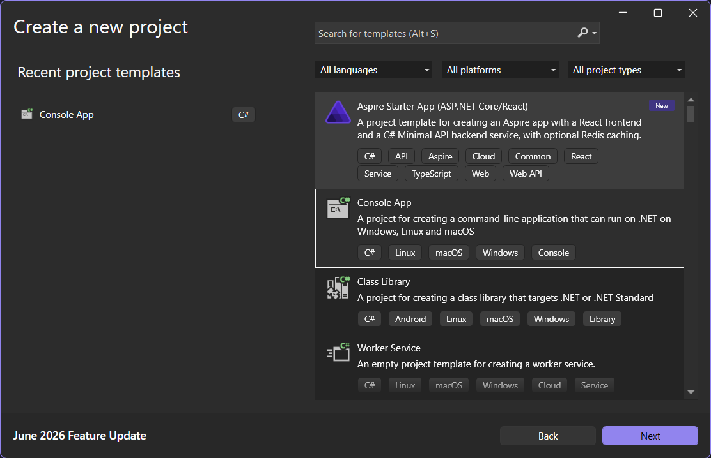

> Day 1 2026-06-21 ,19:58

*Before starting any project it is good idea to establish a framework first.
This is a small side project i want to make to refamiliarize myself with C# concepts.
This project will be featuring a simple snake game on console.*
- ###### The Core parts of the game will include :-
	1. A snake represented by '0' and snake can move in any direction in a 2D grid.
	2. The 2D grid will be represented with '.' . It will be of custom size which player can choose.
		1. Map Size will be selectable from a list from 24 , 36 and 64 size grid.
	3. Random Fruits will be generated according in the map.
		1. Fruits will be represented by 'o' , 'c' and '+'.
		2. Once Eaten Fruits will disappear and appear on random tile on the map.
		3. No of fruits on the Map will be fixed as per the size of the map.
			-  24 size map 4 fruits , 36 size map 6 fruits , 64 size map 10 fruits.
		4.  Fruits and Snake Can not occupy same tile space on the map hence once there is less space on the map then the fruits quantity will be reduced as well.
		5. Fruits will be able to consumed by the snake.
		6. Once Fruit is eaten by the snake, snakes length increases by 1 tile at the end.
	4. Once Snake becomes as Large as the map the game ends.
	5. Snake Can not touch the Edges and Snake Can not touch itself else Game will be over and score will be displayed.
> I'll be adding any other bug fixes and improvements here as an base Game Design Document (GDD).

Now For the Project Setup Part.
First Download *Visual Studio installer* and then choose *C# and .Net Framework* and then install it. You can refer Microsoft official Documentation regarding this.

Once Installed Open the *Visual Studio* and Create a New Project and Choose C# Console App That can run on .Net Framework.
![[Pasted image 20260621205710.png]]Rename it to *ConsoleSnakeGame* or any other name of your choice.
Make a separate folder for this project to avoid future hassle and to keep project separate.
Now Write Below Code and Press Run Button or press **ctrl + F5** to run.
```
namespace ConsoleSnakeGame
{
    internal class Program
    {
        static void Main(string[] args)
        {
            Console.WriteLine("Hello, World!");
        }
    }
}
```

Ignore the syntax for now we will slowly understand it when building the project.
Now we are Ready for Next Step which is learning some Concepts which will be used in our game.

>==Now After this move for the next Part which is learning C# **[[Fundamentals]]**.==